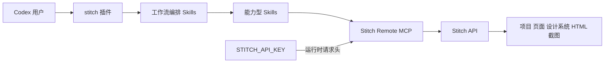
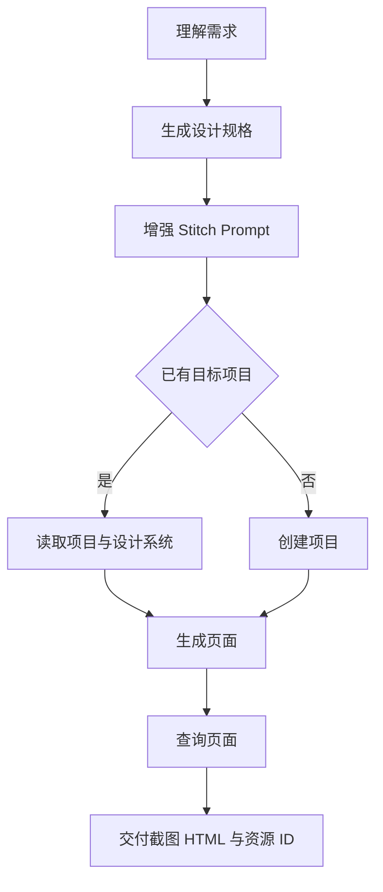
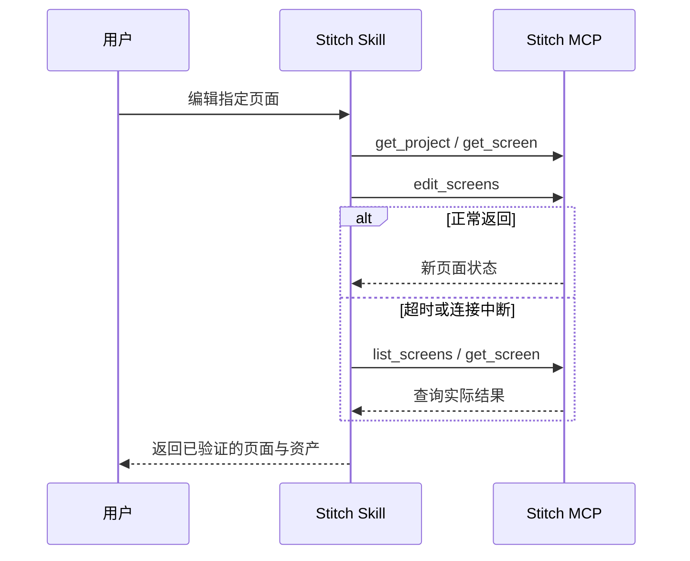

# Stitch Skills 并集与 Codex 插件设计

## 1. 背景与目标

本变更先优化本地 `full-stack-skills/stitch-skills` 技能库，再基于优化后的技能集合创建名为 `stitch` 的个人 Codex 插件。插件通过 Google 官方远程 Stitch MCP 服务操作 Stitch，提供与 Figma Codex 插件相近的自然语言设计工作流。

本地技能库是合并主干。Google 官方 `google-labs-code/stitch-skills` 是上游补充源。本次对比基线为官方提交 `0337446dadde6f8c94210444e2aa9d546126480f`。

## 2. 当前基线

- 本地仓库位于 `/Users/wandl/workspaces/workspace-agent-skills/full-stack-skills-repositories/stitch-skills`。
- 本地存在 29 个 Skill 目录；中英文 README 仍声明 28 个，需要校正。
- 官方基线存在 16 个 Skills，分布于 `stitch-design`、`stitch-build`、`stitch-utilities` 三个插件。
- 本地与官方仓库均采用 Apache-2.0 许可证。
- Stitch MCP 是远程服务，地址为 `https://stitch.googleapis.com/mcp`，API Key 通过 `X-Goog-Api-Key` 请求头传递。

## 3. 范围

### 3.1 本地技能库优化

1. 建立本地与官方 Skill 的能力矩阵，不仅按目录名判断重复。
2. 保留所有本地独有能力。
3. 引入所有官方独有能力，包括但不限于：
   - `code-to-design`
   - `extract-static-html`
   - `upload-to-stitch`
   - `manage-design-system`
   - `react-native`
   - `react-vite-dashboard`
   - `site-md`
   - `stitch-loop`
   - `taste-design`
4. 对 React、Remotion、shadcn/ui、DESIGN.md、提示增强等重叠能力进行逐文件比较，形成单一规范入口，避免多个 Skill 同时触发。
5. 对来自官方的文件保留许可证和来源记录，并记录上游提交。
6. 更新 README、技能索引和实际数量，使目录、文档与清单一致。
7. 校验 Skill frontmatter、引用路径、脚本语法、依赖关系和触发描述。

### 3.2 Codex 插件

创建个人 marketplace 插件 `stitch`，默认路径为 `/Users/wandl/plugins/stitch`，并更新 `/Users/wandl/.agents/plugins/marketplace.json`。

插件包含：

- `.codex-plugin/plugin.json`
- `.mcp.json`
- `skills/`
- `assets/`
- `README.md`
- `LICENSE`
- 上游来源和许可证说明

插件的 Skills 来源于优化完成后的本地技能库快照，不通过符号链接依赖开发仓库，确保插件可以独立安装、分享和校验。

## 4. 合并规则

### 4.1 分类

每个 Skill 必须归入以下一种状态：

- `LOCAL_ONLY`：本地独有，原样保留并进行规范校验。
- `UPSTREAM_ONLY`：官方独有，引入本地并按本地命名规则适配。
- `OVERLAP_MERGED`：能力重叠，选择一个规范名称，将双方有价值内容融合到同一 Skill。
- `SUPERSEDED`：内容完全被规范 Skill 覆盖，仅在迁移表中记录，不继续暴露触发入口。

### 4.2 冲突处理

- 本地面向 Vue、uni-app 和国内组件库的能力不得因引入官方内容而退化。
- 官方在 React、React Native、代码回传、设计系统和循环构建方面的新增能力必须保留。
- 相同触发意图不得存在两个含义近似、执行顺序冲突的 Skill。
- 目录名和 frontmatter `name` 必须一致，统一使用 lower-case hyphen-case。
- 合并不得删除双方独有的安全约束、验证步骤、脚本或参考资料。
- 对外部命令、包和脚本的调用必须明确先决条件，不得暗示已安装。

## 5. 插件架构

插件以 MCP 为执行层、Skills 为编排层：

- MCP 工具执行项目、页面、变体和设计系统操作。
- Skills 负责意图识别、提示增强、调用顺序、超时恢复、结果验证和资产交付。
- 首版不自建 Stitch SDK 代理服务，避免重复封装官方 MCP。

## 6. 鉴权与安全

- 插件不得包含真实 API Key、访问令牌或用户项目数据。
- 使用 `STITCH_API_KEY` 环境变量配置 `X-Goog-Api-Key`。
- README 引导用户在 Stitch Settings 创建、吊销和轮换密钥。
- 日志、错误报告和示例不得回显密钥。
- 删除项目不提供自动化工作流；若底层 MCP 暴露删除能力，Skill 必须要求明确确认。
- 页面生成或编辑发生超时、断连时不得立即重试写操作，应先查询项目和页面状态。

## 7. 关键工作流

### 7.1 新设计

### 7.2 编辑与异常恢复

## 8. 验收标准

### 8.1 技能库

- 能力矩阵覆盖本地 29 个目录与官方 16 个 Skills，无未分类项。
- 官方独有能力全部可从本地技能库发现。
- 重叠能力不存在明显的双入口触发冲突。
- 所有新增或修改 Skill 通过 Skill 快速校验和 TRACE 检查。
- 所有本地相对引用可解析；Shell、Python、JavaScript/TypeScript 脚本执行对应语法检查。
- README、索引和实际 Skill 数量一致。
- Git diff 不包含密钥、访问令牌或无关用户修改。

### 8.2 Codex 插件

- 插件目录名、manifest 名称和 marketplace 名称均为 `stitch`。
- manifest 使用有效 SemVer，声明 `skills` 与 `.mcp.json`。
- `.mcp.json` 仅引用 `STITCH_API_KEY`，不保存明文密钥。
- marketplace 条目包含安装策略、鉴权策略和分类。
- `validate_plugin.py` 通过。
- 插件内全部 Skill 通过快速校验和 TRACE 检查。
- 在设置环境变量后，新的 Codex 任务可调用 Stitch MCP 的只读 `list_projects`。
- 未设置密钥时，用户得到明确、无泄密的配置提示。

## 9. 非目标

- 不修改或删除用户现有 Stitch 项目。
- 不在首版实现自建 Stitch SDK MCP 网关。
- 不初始化 Spec Kit 或 OpenSpec。
- 不自动安装 Node、Python、Google Cloud SDK 或第三方包。
- 不修改当前 Codex 全局 Stitch MCP 配置中的现有密钥。
- 不反向删除本地已有 Skill，即使官方存在近似能力；重叠项通过融合和迁移记录处理。

## 10. 交付顺序

1. 生成能力矩阵和合并计划。
2. 优化本地技能库并完成校验。
3. 创建并校验个人 `stitch` Codex 插件。
4. 安装或刷新个人 marketplace 插件。
5. 在新 Codex 任务中执行只读连接验证。

## 11. 剩余风险

- Codex 插件 `.mcp.json` 对环境变量插值的准确语法必须通过当前版本的现有样例或验证器确认。
- 官方仓库可能在实施期间更新；本次实现固定以记录的提交为基线，避免合并内容漂移。
- 部分官方 Skills 带 npm 或 TypeScript 依赖，必须明确其按需安装边界并避免插件安装时静默执行。
- 本地 Skill 数量较多，单纯通过目录级校验不足以证明触发质量，需要 TRACE 评测和代表性工作流验证。
