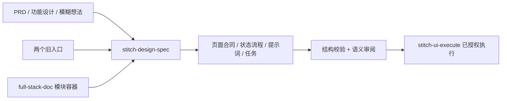

# 设计

## Context

Brownfield；采用现有 OpenSpec。`harden-skill-release-dispatch` 是独立发布变更，保持不动。两个旧入口都存在有效调用者，不能直接删除名称。原有提示词支持三段结构、六类框架契约以及 applied-system / inline / targeted-edit 分流。

## Decisions

1. `stitch-design-spec` 是唯一内容规则所有者；旧入口只传递上下文与期望输出，不复制模板。
2. full-stack-doc 负责文档分层与文件位置，新入口负责其中模块 Stitch 内容；已有功能设计是上游事实源，缺失内容明确为建议。
3. 完整包以页面、状态、流程、来源、任务 ID 关联；模块单文件和 prompt-only 是明确裁剪视图，不强迫小编辑生成全套 PRD。
4. 规格字段是本地语义，不能冒充 MCP 参数。远程设计系统只有已观察到应用证据时才采用 applied-system 模式。
5. 旧资源路径保留转交说明，避免外部历史深链失效；词汇库与有用规则迁入新入口。
6. 附带无网络的完整性校验与人工行为验收案例。静态通过只证明结构，不能证明模型永远遵守或页面已生成。

## Migration and risks

完整安装新增一个入口并保留旧名；只装旧技能的用户需取得新入口，缺失时说明依赖，不自动安装。下游运行时的 `.stitch/specs` 仍按 Harness 实际 schema 适配，不用本地设计合同覆盖。新包与模块模板不得携带绝对路径或历史成功标记。没有调用真实 Stitch，生成效果待执行阶段验证。

## Harness 命名补充

按用户要求将 stitch-delivery-harness 改名为 stitch-design-harness，不保留重复技能目录。stitch-skills 维护规范名称和包引用；design-skills 仅同步现有提供方 profile 的 handler（版本3→4）及历史别名解析文档。此增量的验收事实源为本 change；不另建冲突的规格。运行脚本、账本、profile ID 与证据格式不改，已保存的旧 handler 通过明确别名转交新入口。安装副本与插件发布未纳入本次范围。

## 全库命名补充

按 docs/skill-name-migration.md 迁移15个名称。插件 manifest、目录、frontmatter和活跃引用保持一致，中英文README按流程/合同/转换/工具分类，并单列2个兼容入口。场景生成器保持原输入与生成名称规则，更新下游引用，许可从本技能内读取以支持独立安装。框架的组件契约与prefix/selector输出形状保持兼容，最终提示词模式仍由统一规格入口解释。未发布、未安装、未修改外部插件缓存。

## 领域前缀修正（取代上一轮的具体UI design-*命名）

按用户确认，上层保留stitch-design-spec与stitch-design-harness，具体UI执行/风格/指导/变体/接力/框架契约/代码转换统一stitch-ui-*。本轮迁移22个名称；总路由、文档、MCP和非UI专项保持原名。docs/skill-name-migration.md记录原始名、中间名和最终名，不创建多套能力副本。React Native为stitch-ui-react-native-components，shadcn为stitch-ui-shadcn-components，数据看板保留专项后缀stitch-ui-react-vite-dashboard。两个旧规格兼容入口保留原有迁移职责。
