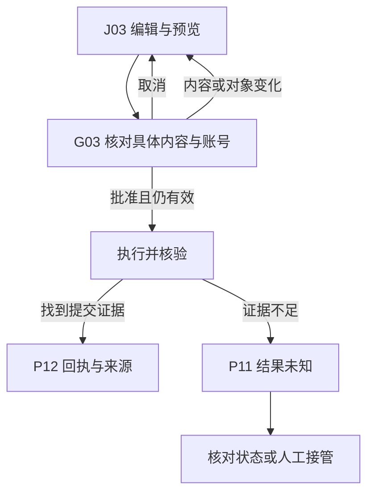

# Agent Browser：从功能流程到 Stitch 规格

## 来源与输入

改写依据：Agent Browser `docs/functional-design/USER-FLOWS.md` 的 F04/F05。原要求：J03 编辑并预览职位申请草稿→G03 具体确认→按已授权账号执行→有提交证据才进入 P12，否则 P11 核对状态。搜索和保存偏好不等于提交授权；内容、对象或账号变化需要重新准备。此处只做设计教学，没有连接真实职位或执行投递。

## 逐面合同

| ID | 性质/职责 | 入口 | 动作与退出 | 状态 |
| --- | --- | --- | --- | --- |
| J03 | 业务工作区，编辑/预览申请 | 已选择候选职位 | 编辑、保存、预览、请求确认；返回候选保留草稿 | 编辑中、校验失败、准备就绪 |
| G03 | 全局确认面，绑定内容/对象/账号 | J03 的具体操作 | 确认进入执行；取消回 J03 保留草稿 | 待确认、目标变化失效、提交中 |
| P11 | 任务跟踪及核对 | 执行后暂无可靠证据 | 核对、等待、必要时人工接管；不自动重复提交 | 等待、结果未知、恢复 |
| P12 | 有来源的成果/回执 | 已核验后置条件 | 查看证据与来源，返回任务 | 已验证结果 |

不要把 G03 变为独立导航页面，不把 P11 的“结果未知”画成成功 toast。

## 界面结构建议（不是原文已批准布局）

桌面复用浏览器外壳；业务区左侧职位/草稿，右侧预览；Agent 侧栏解释任务上下文，不能遮挡用户最终确认。G03 展示具体站点、职位、账号、将发送的正文与附件摘要。Mobile 将编辑/预览改为顺序视图；Tablet 保留分区但确认面可独立滚动。三端都保留取消与实际目标。



## 提示 Q-J03-confirm（inline，无已应用系统）

```text
[Context]
Agent Browser 职位申请流程的 G03 确认面，宿主为 J03 草稿工作区。Desktop 1280×1024，兼顾 Tablet 768×1024 和 Mobile 390×884。全中文；布局为教学建议，视觉沿用项目现有 DESIGN.md，未提供 token 时保持待确认，不假定远程已应用系统。
[Layout]
1. 保留现有浏览器外壳与 J03 草稿背景，在全局确认面集中呈现即将提交的具体对象。
2. 依次显示站点/职位、执行账号、正文与附件摘要；长内容可滚动，确认区不被 Agent 侧栏遮挡。
3. 底部“取消”“确认提交”；窄屏单列，仍完整展示目标与内容。
[Components]
字段值由目标项目已核对上下文提供，不虚构真实职位/账号。取消回 J03 并保留草稿。账号、对象或正文变化时标记确认失效，返回重新准备；执行中禁用重复确认并显示实际等待状态。
只有找到提交证据才进入 P12“回执与来源”；结果不确定时进入 P11“结果未知，待核对”，提供核对状态/人工处理入口，不自动重发。标签与焦点顺序清晰，确认面关闭后焦点返回原发起控件。
```

## 覆盖与任务交接

| 任务 | 依赖 | 输入/产物 | 验收 |
| --- | --- | --- | --- |
| AB-T1 | J03 原合同 | J03编辑/预览及G03提示 | 取消保留草稿，确认绑定对象内容账号 |
| AB-T2 | AB-T1 | P11未知/恢复与P12证据页提示 | 未找到证据不展示成功、不提供自动重复提交 |
| AB-T3 | AB-T1,AB-T2 | F05跨页验证记录 | 目标改变使确认失效，三端都能读全实际目标 |

本例仅完整展开 Q-J03-confirm；J03 编辑页、P11/P12 提示待按其页面合同补齐，不能称全产品覆盖。将 AB-T* 引用回项目 MASTER-PLAN/OpenSpec；此处不是实现完成记录。
