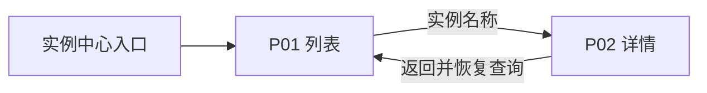
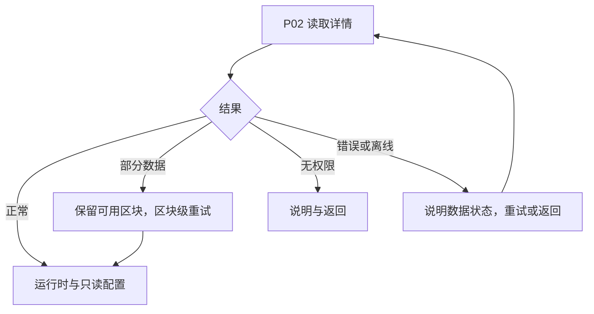

# 实例中心设计总览

## 页面与职责

| ID | 职责 | 入口 | 返回/退出 | 权限 | 来源 |
| --- | --- | --- | --- | --- | --- |
| P01 | 搜索筛选、比较实例健康 | 导航“实例中心” | 点击名称到 P02；切换模块 | 本案例只读角色（假设） | S1/S2 |
| P02 | 查看单实例运行时与证据 | P01 名称 | 返回 P01，保留查询/分页/滚动 | 同上，无权限给说明 | S1/S2 |

## 结构与视觉

共享外壳：左侧模块导航、顶栏产品/当前模块、主业务区；本示例无 Agent 侧栏。P01 业务区为标题/概览→筛选→列表→分页；P02 为面包屑→身份与状态→桌面 70/30 详情双栏。S3 是建议 token，内联进入各提示。不要给详情另造一套导航。

## F01 查询与返回

前置：用户进入实例中心；输入搜索词→加载→呈现匹配项→查看详情→返回恢复查询。筛选改变时页码归一；加载失败保留筛选，重试同一查询；零结果提供清除筛选；离线保留最后可用数据并标记过期。

## F02 详情与恢复

不请求新权限、不模拟读取成功；实例已不存在对应 empty。取消读取即返回列表，不产生写入。

## 跨端与无障碍

Desktop：持久侧栏、数据表、详情双栏。Tablet：导航可收起，表格受控横向滚动，详情顺序不变。Mobile：导航抽屉、实例卡片、详情单列，名称/健康/查看动作优先；不能隐藏错误或返回入口。键盘顺序跟随阅读顺序；每个输入有可见标签，焦点可见，状态文字不依赖颜色，动效遵循减少动态效果设置。
