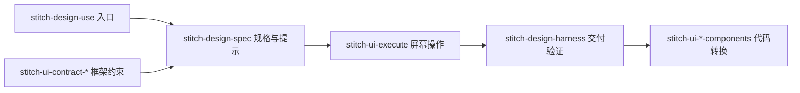

# Stitch 技能库结构

本文件说明当前职责分层；完整清单及安装方式以 [中文 README](README.zh-CN.md)、[English README](README.md) 和 `.claude-plugin/plugin.json` 为准。

当前共44个注册名称：42个主要技能、2个旧规格兼容入口。旧名称映射见[迁移表](docs/skill-name-migration.md)。上游来源与许可见 [NOTICE](NOTICE)。

## 设计到实现

图表示职责关系，不要求每次请求都执行全部阶段。本地规格编写不调用远程工具；实际生成、上传和代码修改沿用当前任务授权。

## 命名分层

- 上层规格与交付入口：stitch-design-spec、stitch-design-harness。
- 具体UI能力：stitch-ui-*，含执行、风格、指导、变体、页面接力和目标框架实现。
- 框架约束：stitch-ui-contract-*；代码转换：stitch-ui-<技术栈>-components；专项看板：stitch-ui-react-vite-dashboard。
- MCP工具适配：stitch-mcp-*；总路由、文档、上传、设置、视频和技能生成等专项入口保持原名。

## 规则所有者

- 页面规格与最终提示词：stitch-design-spec。
- 框架组件约束：stitch-ui-contract-*；prefix/selector保持已有数据合同。
- 屏幕操作：stitch-ui-execute；底层MCP工具名不随技能更名。
- 完整设计交付：stitch-design-harness；运行脚本与既有证据格式保持稳定。
- 风格提案、表达指导、变体提示、页面接力分别由 style、guide、variants、loop 技能承担。
- DESIGN.md 来源提取、SITE.md 计划及远程设计系统应用保留各自入口。
- components 技能负责目标框架代码；框架风格设计图不是代码交付。

两个旧规格入口仅转交统一入口；历史上游记录保留其发生时的名称，不作为当前注册清单。
